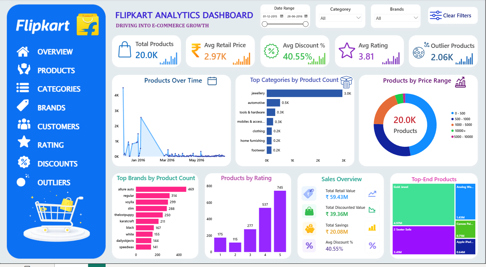

# Flipkart_End_to_End_Analytics_Project

## End-to-End E-Commerce Product Analytics Project

An end-to-end e-commerce analytics project built using Python, SQL Server, and Power BI to analyze Flipkart product pricing, discounts, ratings, categories, brands, and premium outlier products through interactive dashboards and business intelligence reporting.

---

# Dashboard Preview



---

# Project Overview

The Flipkart Analytics Dashboard project demonstrates a complete data analytics workflow starting from raw e-commerce product data and transforming it into actionable business intelligence insights.

The project includes:

* Python Data Cleaning & Feature Engineering
* SQL Server Business Analysis
* Power BI Dashboard Development
* Product Pricing & Discount Analysis
* Brand & Category Performance Analysis
* Outlier Product Detection

---

# Business Problem

This project answers important e-commerce business questions such as:

* Which products are highly priced?
* Which categories provide maximum discounts?
* Which brands dominate product listings?
* Which products are premium outliers?
* Which products provide the highest savings?
* How are product ratings distributed?
* Which brands provide high ratings with high discounts?

---

# Dataset Information

| Attribute     | Details                             |
| ------------- | ----------------------------------- |
| Dataset Type  | Retail / E-Commerce Product Dataset |
| Source        | Kaggle Flipkart Product Dataset     |
| Final Records | 20,001 Products                     |
| Final Columns | 17 Columns                          |
| Domain        | E-Commerce Product Analytics        |

---

# Tools & Technologies Used

| Tool             | Purpose                 |
| ---------------- | ----------------------- |
| Python           | Data Cleaning & EDA     |
| Pandas           | Data Manipulation       |
| NumPy            | Numerical Operations    |
| SQL Server       | Business Analysis       |
| Power BI         | Dashboard Visualization |
| Jupyter Notebook | Development Environment |

---

# Project Workflow

```text id="lznr3v"
Raw CSV Dataset
        ↓
Python Data Cleaning & Feature Engineering
        ↓
SQL Server Analysis
        ↓
Power BI Dashboard Development
        ↓
Business Insights & Reporting
```

---

# Python Data Cleaning Pipeline

The dataset was cleaned using Python and Pandas.

### Cleaning Steps

* Loaded CSV dataset into Pandas DataFrame
* Handled missing values
* Removed duplicate rows
* Standardized column names
* Converted data types
* Standardized text formatting
* Created discount percentage feature
* Created price outlier feature
* Exported cleaned dataset to SQL Server

### Feature Engineering

* `discount_percentage`
* `price_outlier`

### Outlier Detection

Used the IQR (Interquartile Range) method to identify premium product outliers.

Total Outlier Products:

* 2,063 products

---

# SQL Server Analysis

SQL queries were used to answer multiple business questions related to:

* Product Pricing
* Discount Analysis
* Brand Performance
* Category Analysis
* Product Ratings
* Savings Analysis
* Outlier Detection
* Best Value Products

### Key SQL Insights

* Average Retail Price: ₹2.97K
* Average Discounted Price: ₹1.97K
* Average Discount: 40.55%
* Average Rating: 3.81
* Outlier Products: 2.06K

---

# Power BI Dashboard Features

The Power BI dashboard includes:

* KPI Cards
* Product Trend Analysis
* Price Range Distribution
* Brand Performance Analysis
* Rating Distribution
* Sales Overview
* Treemap Visualization
* Interactive Filters & Slicers

### KPI Cards

* Total Products
* Average Retail Price
* Average Discount %
* Average Rating
* Outlier Products

---

# Key Business Insights

* 20,001 cleaned products analyzed
* Jewellery dominates category listings
* Average discount reached 40.55%
* 2,063 premium outlier products identified
* Luxury watches and premium furniture appeared as top-end products
* Several brands achieved high ratings with strong discount strategies

---

# Repository Structure

```text id="upgh4z"
Flipkart-Analytics-Dashboard/
│
├── dataset/
│   └── flipkart_dataset.csv
│
├── notebook/
│   └── flipkart_data_cleaning.ipynb
│
├── sql_queries/
│   └── flipkart_data_analysis.sql
│
├── powerbi_dashboard/
│   └── flipkart_analytics_dashboard.pbix
│
├── report/
│   └── Report-Flipkart_Analytics_Dashboard.pdf
│
├── presentation/
│   └── Flipkart_Analytics_Presentation.pdf
│
├── screenshots/
│   └── Flipkart_Analytics_Dashboard.png
│
├── README.md
├── LICENSE
└── .gitignore
```

---

# Future Scope

* Revenue forecasting models
* Product recommendation systems
* Customer transaction analysis
* Advanced drill-through reports
* Live SQL dashboard refresh
* Product image analytics using AI

---

# Disclaimer

This project is created for educational and portfolio purposes only. The dataset used in this project is sourced from publicly available Flipkart e-commerce records.

---

# Author

## Miryala Yashwanth

* Python
* SQL Server
* Power BI
* Data Analytics
* E-Commerce Analytics

